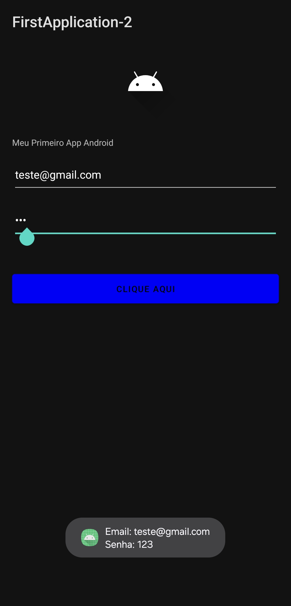

# Meu Primeiro App Android

Este é um projeto de aplicativo Android simples sendo uma atividade com adição de funcionalidade do código anterior.

## Nova Funcionalidade

* Tela de login simples agora com campo de Senha.
* Um botão que, ao ser clicado, exibe os dados inseridos nos campos em Toast

### Alterações Realizadas

O projeto inicial foi evoluído com as seguintes modificações:

1.  **Adição do Campo de Senha:**
    * No arquivo `activity_main.xml`, foi adicionado um novo `EditText` com o `id` `edit_text_password`.
    * Foi definido como `"textPassword"` para o padrão em campos de senhas(•••).

2.  **Atualização da Lógica no `MainActivity.kt`:**
    * Foi atualizado pra receber o campo de senha.
    * A lógica do `onClickListener` do botão foi altera para capturar o texto dos dois campos (e-mail e senha).
    * Além de ser implementada a exibição de um `Toast` que mostra o e-mail e a senha digitados pelo usuário na parte inferior do dispositivo